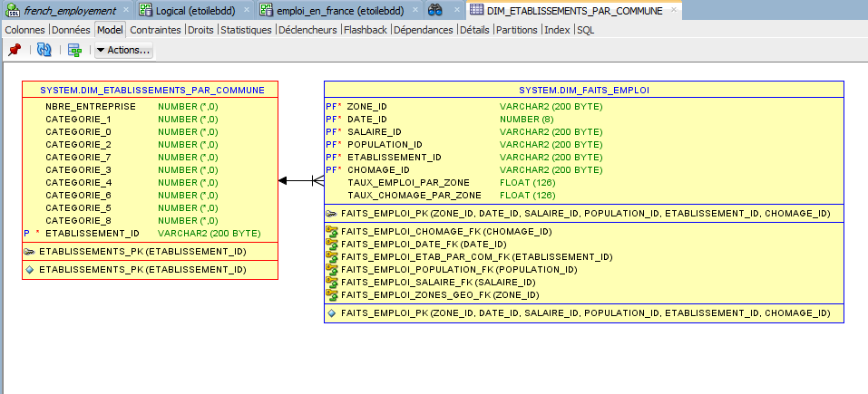
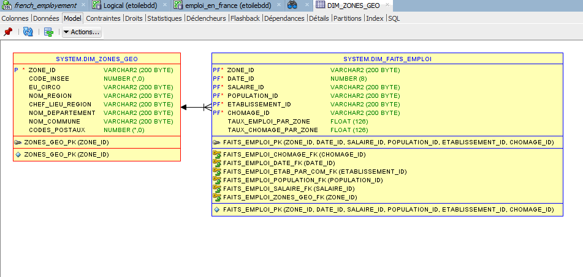
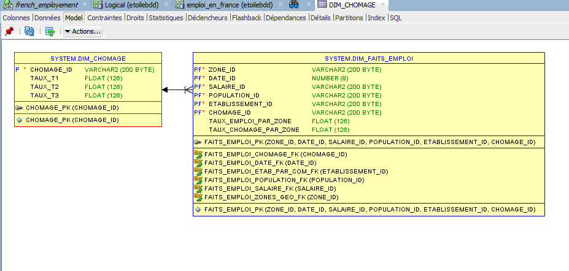
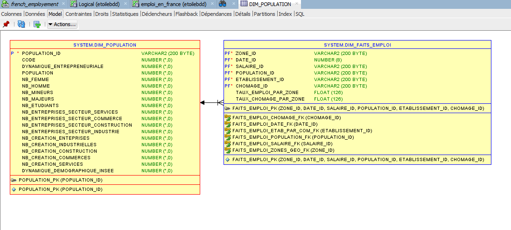
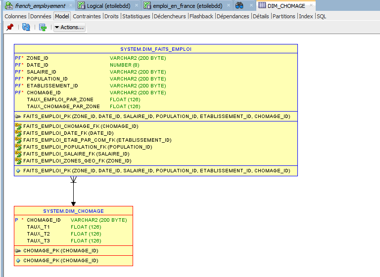
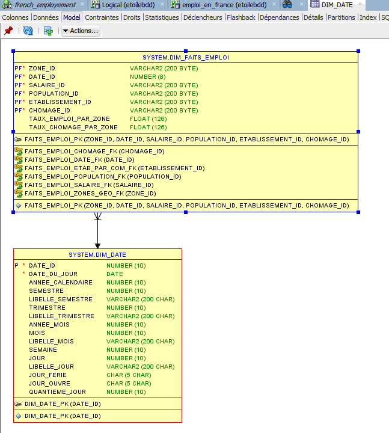
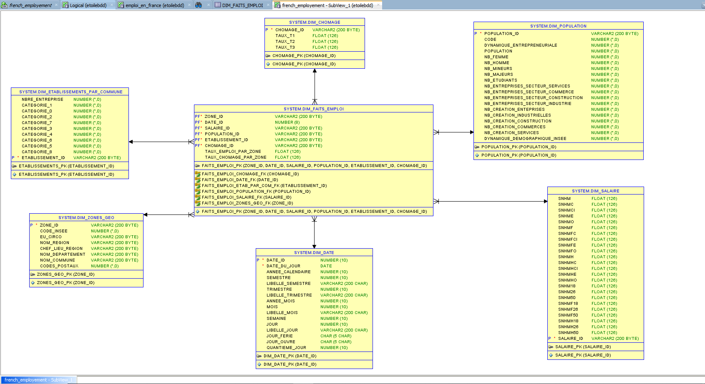

# Entrepot de données 

## Processus 

Etude sur le marché de l'emploi francais et comparaison avec le taux de chômage par trimestre.


## Grain de processus


## Dimensions et table des faits
### Dimensions :

##### * Etablissements : Cette dimension donne des informations sur le nombre d'entreprises dans chaque ville française, classées par taille.
source : INSEE.

```bash
 CREATE TABLE "SYSTEM"."DIM_ETABLISSEMENTS_PAR_COMMUNE" 
   (	"NBRE_ENTREPRISE" NUMBER(*,0), 
	"CATEGORIE_1" NUMBER(*,0), 
	"CATEGORIE_0" NUMBER(*,0), 
	"CATEGORIE_2" NUMBER(*,0), 
	"CATEGORIE_7" NUMBER(*,0), 
	"CATEGORIE_3" NUMBER(*,0), 
	"CATEGORIE_4" NUMBER(*,0), 
	"CATEGORIE_6" NUMBER(*,0), 
	"CATEGORIE_5" NUMBER(*,0), 
	"CATEGORIE_8" NUMBER(*,0), 
	"ETABLISSEMENT_ID" VARCHAR2(200 BYTE)
   ) PCTFREE 10 PCTUSED 40 INITRANS 1 MAXTRANS 255 
 NOCOMPRESS LOGGING
  STORAGE(INITIAL 65536 NEXT 1048576 MINEXTENTS 1 MAXEXTENTS 2147483645
  PCTINCREASE 0 FREELISTS 1 FREELIST GROUPS 1
  BUFFER_POOL DEFAULT FLASH_CACHE DEFAULT CELL_FLASH_CACHE DEFAULT)
  TABLESPACE "SYSTEM" ;
REM INSERTING into SYSTEM.DIM_ETABLISSEMENTS_PAR_COMMUNE
SET DEFINE OFF;
```



##### * Zones : cette dimension renseigne sur les données géographiques de chaque commune française principalement.
source : INSEE

```bash
CREATE TABLE "SYSTEM"."DIM_ZONES_GEO" 
   (	"ZONE_ID" VARCHAR2(200 BYTE), 
	"CODE_INSEE" NUMBER(*,0), 
	"EU_CIRCO" VARCHAR2(200 BYTE), 
	"NOM_REGION" VARCHAR2(200 BYTE), 
	"CHEF_LIEU_REGION" VARCHAR2(200 BYTE), 
	"NOM_DEPARTEMENT" VARCHAR2(200 BYTE), 
	"NOM_COMMUNE" VARCHAR2(200 BYTE), 
	"CODES_POSTAUX" NUMBER(*,0)
   ) PCTFREE 10 PCTUSED 40 INITRANS 1 MAXTRANS 255 
 NOCOMPRESS LOGGING
  STORAGE(INITIAL 65536 NEXT 1048576 MINEXTENTS 1 MAXEXTENTS 2147483645
  PCTINCREASE 0 FREELISTS 1 FREELIST GROUPS 1
  BUFFER_POOL DEFAULT FLASH_CACHE DEFAULT CELL_FLASH_CACHE DEFAULT)
  TABLESPACE "SYSTEM" ;
REM INSERTING into SYSTEM.DIM_ZONES_GEO
SET DEFINE OFF;
```


##### * Salaire : cette dimension renseigne sur les salaires dans les villes francaises par catégories d'emploi, âge et sexe
source : INSEE
```bash
CREATE TABLE "SYSTEM"."DIM_SALAIRE" 
   (	"SNHM" FLOAT(126), 
	"SNHMC" FLOAT(126), 
	"SNHMCI" FLOAT(126), 
	"SNHME" FLOAT(126), 
	"SNHMO" FLOAT(126), 
	"SNHMF" FLOAT(126), 
	"SNHMFC" FLOAT(126), 
	"SNHMFCI" FLOAT(126), 
	"SNHMFE" FLOAT(126), 
	"SNHMFO" FLOAT(126), 
	"SNHMH" FLOAT(126), 
	"SNHMHC" FLOAT(126), 
	"SNHMHCI" FLOAT(126), 
	"SNHMHE" FLOAT(126), 
	"SNHMHO" FLOAT(126), 
	"SNHM18" FLOAT(126), 
	"SNHM26" FLOAT(126), 
	"SNHM50" FLOAT(126), 
	"SNHMF18" FLOAT(126), 
	"SNHMF26" FLOAT(126), 
	"SNHMF50" FLOAT(126), 
	"SNHMH18" FLOAT(126), 
	"SNHMH26" FLOAT(126), 
	"SNHMH50" FLOAT(126), 
	"SALAIRE_ID" VARCHAR2(200 BYTE)
   ) PCTFREE 10 PCTUSED 40 INITRANS 1 MAXTRANS 255 
 NOCOMPRESS LOGGING
  STORAGE(INITIAL 65536 NEXT 1048576 MINEXTENTS 1 MAXEXTENTS 2147483645
  PCTINCREASE 0 FREELISTS 1 FREELIST GROUPS 1
  BUFFER_POOL DEFAULT FLASH_CACHE DEFAULT CELL_FLASH_CACHE DEFAULT)
  TABLESPACE "SYSTEM" ;
REM INSERTING into SYSTEM.DIM_SALAIRE
SET DEFINE OFF;
```


##### * Population : ces données renseignent sur la population démographique en france.
source : INSEE

```bash
CREATE TABLE "SYSTEM"."DIM_POPULATION" 
   (	"POPULATION_ID" VARCHAR2(200 BYTE), 
	"CODE" NUMBER(*,0), 
	"DYNAMIQUE_ENTREPRENEURIALE" NUMBER(*,0), 
	"POPULATION" NUMBER(*,0), 
	"NB_FEMME" NUMBER(*,0), 
	"NB_HOMME" NUMBER(*,0), 
	"NB_MINEURS" NUMBER(*,0), 
	"NB_MAJEURS" NUMBER(*,0), 
	"NB_ETUDIANTS" NUMBER(*,0), 
	"NB_ENTREPRISES_SECTEUR_SERVICES" NUMBER(*,0), 
	"NB_ENTREPRISES_SECTEUR_COMMERCE" NUMBER(*,0), 
	"NB_ENTREPRISES_SECTEUR_CONSTRUCTION" NUMBER(*,0), 
	"NB_ENTREPRISES_SECTEUR_INDUSTRIE" NUMBER(*,0), 
	"NB_CREATION_ENTEPRISES" NUMBER(*,0), 
	"NB_CREATION_INDUSTRIELLES" NUMBER(*,0), 
	"NB_CREATION_CONSTRUCTION" NUMBER(*,0), 
	"NB_CREATION_COMMERCES" NUMBER(*,0), 
	"NB_CREATION_SERVICES" NUMBER(*,0), 
	"DYNAMIQUE_DEMOGRAPHIQUE_INSEE" NUMBER(*,0)
   ) PCTFREE 10 PCTUSED 40 INITRANS 1 MAXTRANS 255 
 NOCOMPRESS LOGGING
  STORAGE(INITIAL 65536 NEXT 1048576 MINEXTENTS 1 MAXEXTENTS 2147483645
  PCTINCREASE 0 FREELISTS 1 FREELIST GROUPS 1
  BUFFER_POOL DEFAULT FLASH_CACHE DEFAULT CELL_FLASH_CACHE DEFAULT)
  TABLESPACE "SYSTEM" ;
REM INSERTING into SYSTEM.DIM_POPULATION
SET DEFINE OFF;
```



##### * Chomage : Ces dimension renseigne sur le taux de chomage en 2019 par trimestre.
source : INSEE

```bash
CREATE TABLE "SYSTEM"."DIM_CHOMAGE" 
   (	"CHOMAGE_ID" VARCHAR2(200 BYTE), 
	"TAUX_T1" FLOAT(126), 
	"TAUX_T2" FLOAT(126), 
	"TAUX_T3" FLOAT(126)
   ) PCTFREE 10 PCTUSED 40 INITRANS 1 MAXTRANS 255 
 NOCOMPRESS LOGGING
  STORAGE(INITIAL 65536 NEXT 1048576 MINEXTENTS 1 MAXEXTENTS 2147483645
  PCTINCREASE 0 FREELISTS 1 FREELIST GROUPS 1
  BUFFER_POOL DEFAULT FLASH_CACHE DEFAULT CELL_FLASH_CACHE DEFAULT)
  TABLESPACE "SYSTEM" ;
REM INSERTING into SYSTEM.DIM_CHOMAGE
SET DEFINE OFF;
```


#### * Date : 
```bash
CREATE TABLE "SYSTEM"."DIM_DATE" 
   (	"DATE_ID" NUMBER(10,0), 
	"DATE_DU_JOUR" DATE, 
	"ANNEE_CALENDAIRE" NUMBER(10,0), 
	"SEMESTRE" NUMBER(10,0), 
	"LIBELLE_SEMESTRE" VARCHAR2(200 CHAR), 
	"TRIMESTRE" NUMBER(10,0), 
	"LIBELLE_TRIMESTRE" VARCHAR2(200 CHAR), 
	"ANNEE_MOIS" NUMBER(10,0), 
	"MOIS" NUMBER(10,0), 
	"LIBELLE_MOIS" VARCHAR2(200 CHAR), 
	"SEMAINE" NUMBER(10,0), 
	"JOUR" NUMBER(10,0), 
	"LIBELLE_JOUR" VARCHAR2(200 CHAR), 
	"JOUR_FERIE" CHAR(5 CHAR), 
	"JOUR_OUVRE" CHAR(5 CHAR), 
	"QUANTIEME_JOUR" NUMBER(10,0)
   ) PCTFREE 10 PCTUSED 40 INITRANS 1 MAXTRANS 255 
 NOCOMPRESS LOGGING
  STORAGE(INITIAL 65536 NEXT 1048576 MINEXTENTS 1 MAXEXTENTS 2147483645
  PCTINCREASE 0 FREELISTS 1 FREELIST GROUPS 1
  BUFFER_POOL DEFAULT FLASH_CACHE DEFAULT CELL_FLASH_CACHE DEFAULT)
  TABLESPACE "SYSTEM" ;
REM INSERTING into SYSTEM.DIM_DATE
SET DEFINE OFF;
```


### Schéma en étoile complet

```bash
CREATE TABLE "SYSTEM"."DIM_FAITS_EMPLOI" 
   (	"ZONE_ID" VARCHAR2(200 BYTE), 
	"DATE_ID" NUMBER(8,0), 
	"SALAIRE_ID" VARCHAR2(200 BYTE), 
	"POPULATION_ID" VARCHAR2(200 BYTE), 
	"ETABLISSEMENT_ID" VARCHAR2(200 BYTE), 
	"CHOMAGE_ID" VARCHAR2(200 BYTE), 
	"TAUX_EMPLOI_PAR_ZONE" FLOAT(126), 
	"TAUX_CHOMAGE_PAR_ZONE" FLOAT(126)
   ) PCTFREE 10 PCTUSED 40 INITRANS 1 MAXTRANS 255 
 NOCOMPRESS LOGGING
  STORAGE(INITIAL 65536 NEXT 1048576 MINEXTENTS 1 MAXEXTENTS 2147483645
  PCTINCREASE 0 FREELISTS 1 FREELIST GROUPS 1
  BUFFER_POOL DEFAULT FLASH_CACHE DEFAULT CELL_FLASH_CACHE DEFAULT)
  TABLESPACE "SYSTEM" ;
REM INSERTING into SYSTEM.DIM_FAITS_EMPLOI
SET DEFINE OFF;
```


## Integration avec Talend

## Installation


## Auteurs
* Papa Farba Ndour
* Babacar Ndour
* Fatim Toure

## License

This project is licensed under the [MIT License](https://choosealicense.com/licenses/mit/) - see the LICENSE.md file for details.
