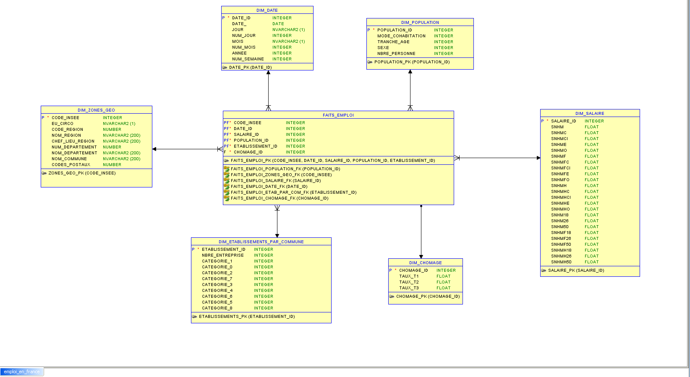

# Entrepot de données 

## Processus 

Etude sur le marché de l'emploi francais et comparaison avec le taux de chômage par trimestre.


## Grain de processus


## Dimensions et et table des faits

```bash

```

## Schema en etoile




## Oracle - SQL Developper


## Integration avec Talend

## Installation


## Contribution
* Papa Farba Ndour
* Babacar Ndour
* Fatim Toure

## License
[MIT License ](https://choosealicense.com/licenses/mit/)
